# e-klemmen

| Symbol | Abbildung |
|---|---|
| `EINSPEISUNG_1-N-PE` |  |
| `EINSPEISUNG_3-N-PE` |  |
| `EINSPEISUNG_3-PE` |  |
| `EINSPEISUNG_GLEICHSPANNUNG` |  |
| `ERDE_ALLGEMEIN` |  |
| `ERDE_MIT_ANGABE_DER_ERDUNGSART_[BETRIEBSERDE]` |  |
| `FREMDSPANNUNGS_ERDE` |  |
| `KLEMME_1-1` |  |
| `KLEMME_1-10` |  |
| `KLEMME_1-11` |  |
| `KLEMME_1-12` |  |
| `KLEMME_1-13` |  |
| `KLEMME_1-14` |  |
| `KLEMME_1-15` |  |
| `KLEMME_1-16` |  |
| `KLEMME_1-17` |  |
| `KLEMME_1-18` |  |
| `KLEMME_1-19` |  |
| `KLEMME_1-2` |  |
| `KLEMME_1-20` |  |
| `KLEMME_1-21` |  |
| `KLEMME_1-22` |  |
| `KLEMME_1-23` |  |
| `KLEMME_1-24` |  |
| `KLEMME_1-25` |  |
| `KLEMME_1-26` |  |
| `KLEMME_1-27` |  |
| `KLEMME_1-28` |  |
| `KLEMME_1-29` |  |
| `KLEMME_1-3` |  |
| `KLEMME_1-30` |  |
| `KLEMME_1-31` |  |
| `KLEMME_1-32` |  |
| `KLEMME_1-33` |  |
| `KLEMME_1-34` |  |
| `KLEMME_1-35` |  |
| `KLEMME_1-36` |  |
| `KLEMME_1-37` |  |
| `KLEMME_1-38` |  |
| `KLEMME_1-39` |  |
| `KLEMME_1-4` |  |
| `KLEMME_1-40` |  |
| `KLEMME_1-41` |  |
| `KLEMME_1-42` |  |
| `KLEMME_1-43` |  |
| `KLEMME_1-44` |  |
| `KLEMME_1-45` |  |
| `KLEMME_1-46` |  |
| `KLEMME_1-47` |  |
| `KLEMME_1-48` |  |
| `KLEMME_1-49` |  |
| `KLEMME_1-5` |  |
| `KLEMME_1-50` |  |
| `KLEMME_1-6` |  |
| `KLEMME_1-7` |  |
| `KLEMME_1-8` |  |
| `KLEMME_1-9` |  |
| `KLEMME_2-1` |  |
| `KLEMME_2-10` |  |
| `KLEMME_2-11` |  |
| `KLEMME_2-12` |  |
| `KLEMME_2-13` |  |
| `KLEMME_2-14` |  |
| `KLEMME_2-15` |  |
| `KLEMME_2-16` |  |
| `KLEMME_2-17` |  |
| `KLEMME_2-18` |  |
| `KLEMME_2-19` |  |
| `KLEMME_2-2` |  |
| `KLEMME_2-20` |  |
| `KLEMME_2-3` | 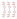 |
| `KLEMME_2-3_LED` |  |
| `KLEMME_2-4` |  |
| `KLEMME_2-5` | 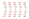 |
| `KLEMME_2-6` | 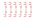 |
| `KLEMME_2-7` | 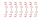 |
| `KLEMME_2-8` | 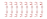 |
| `KLEMME_2-9` | 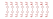 |
| `KLEMME_3-1` |  |
| `KLEMME_3-2` |  |
| `KLEMME_3-3` | 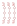 |
| `KLEMME_3-4` |  |
| `KLEMME_3-5` |  |
| `KLEMME_4-1` |  |
| `KLEMME_4-2` |  |
| `KLEMME_4-3` | 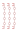 |
| `KLEMME_4-4` | 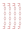 |
| `KLEMME_4-5` | 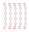 |
| `KLEMME_5-1` |  |
| `KLEMME_5-2` |  |
| `KLEMME_5-3` | 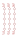 |
| `KLEMME_5-4` |  |
| `KLEMME_5-5` | 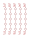 |
| `KLEMME-2_10-BRUECKE` |  |
| `KLEMME-2_11-BRUECKE` |  |
| `KLEMME-2_12-BRUECKE` |  |
| `KLEMME-2_13-BRUECKE` |  |
| `KLEMME-2_14-BRUECKE` |  |
| `KLEMME-2_15-BRUECKE` |  |
| `KLEMME-2_16-BRUECKE` |  |
| `KLEMME-2_17-BRUECKE` |  |
| `KLEMME-2_18-BRUECKE` |  |
| `KLEMME-2_19-BRUECKE` |  |
| `KLEMME-2_2-BRUECKE` |  |
| `KLEMME-2_20-BRUECKE` |  |
| `KLEMME-2_3-BRUECKE` |  |
| `KLEMME-2_4-BRUECKE` |  |
| `KLEMME-2_5-BRUECKE` |  |
| `KLEMME-2_50-BRUECKE` |  |
| `KLEMME-2_6-BRUECKE` |  |
| `KLEMME-2_7-BRUECKE` |  |
| `KLEMME-2_8-BRUECKE` |  |
| `KLEMME-2_9-BRUECKE` |  |
| `MASSE_ALLGEMEIN` |  |
| `MASSE_MIT_ANGABE_DES_POTENZIALS` |  |
| `RELAISKLEMME_MIT_LED` |  |

