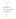
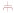

# e-kondensatoren

| Symbol | Abbildung |
|---|---|
| `DIFFERENZIALKONDENSATOR` |  |
| `DURCHFUEHRUNGSKONDENSATOR_KOAXIAL` |  |
| `GEPOLTER_ELEKTROLYTKONDENSATOR` |  |
| `GEPOLTER_KONDENSATOR` |  |
| `KONDENSATOR_KAPAZITAET_ALLGEMEIN` |  |
| `KONDENSATOR_KAPAZITAET_EINSTELLBAR_[TRIMMER]` |  |
| `KONDENSATOR_KAPAZITAET_VERAENDERBAR_MIT_ANGABE_DES_BEWEGBAREN_TEILES` |  |
| `KONDENSATOR_MIT_ANZAPFUNG` |  |
| `KONDENSATOR_MIT_KENNZEICHNUNG_DES_AUSSENBELAGS` |  |
| `UNGEPOLTER_ELEKTROLYTKONDENSATOR` |  |

