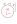
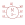
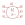
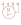

# e-motoren

| Symbol | Abbildung |
|---|---|
| `MOTOR_1-PHASEN` |  |
| `MOTOR_3-PHASEN_STERN-DREIECK_ANLAUF` |  |
| `MOTOR_3-PHASEN_STERN-DREIECK-ANLAUF_ALTERNATIV` |  |
| `MOTOR_3-POL_PE` |  |

