# e-sps

| Symbol | Abbildung |
|---|---|
| `AL2-14MR-D` | 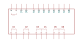 |
| `AL2-24MR-A` | 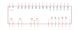 |
| `AL2-24MR-D` | 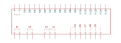 |
| `AL2-2DA` | 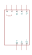 |
| `AL2-2PT-ADP` | 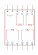 |
| `AL2-4EX` | 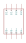 |
| `AL2-4EX-A2` | 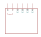 |
| `AL2-4EYR` | 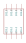 |
| `AL2-4EYT` | 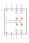 |
| `MICRO_SPS_AVR` |  |
| `MICRO_SPS_PIC` |  |
| `S7-1200_AC DC RELAIS` |  |
| `S7-1200_DC DC DC` |  |
| `SB_1223_DC DC` | 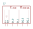 |
| `SB_1232AO1` |  |
| `SM_1221_DI_16X24VDC` | 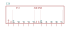 |
| `SM_1221_DI_8X24VDC` | 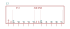 |
| `SM_1223_DI-16X24VDC_DO-16X24VDC` |  |
| `SM_1223_DI-16X24VDC_DO-16XRELAIS` |  |
| `SM_1231_AI4X13BIT` | 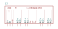 |
| `SM_1232_AQ2X14BIT` | 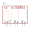 |
| `SM_1234_AI4X13BIT-AQ2X14BIT` | 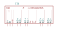 |
| `SM1222_DO_16X24VDC` | 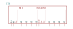 |
| `SM1222_DO_16XRELAIS` | 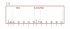 |

