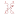
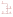
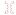
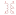

# e-spulen-transformatoren

| Symbol | Abbildung |
|---|---|
| `DREIPHASEN-TRANSFORMATOR` |  |
| `REGELBARER_TRANSFORMATOR` |  |
| `SPARTRANSFORMATOR` |  |
| `SPULE` |  |
| `SPULE_ALTERNATIV` |  |
| `SPULE_GESCHIRMT` |  |
| `SPULE_MIT_KERN` |  |
| `SPULE_MIT_KERN_UND_LUFTSPALT` |  |
| `STETIG_VERAENDERBARE_INDUKTIVITAET` |  |
| `TRANSFORMATOR` |  |
| `TRANSFORMATOR_MIT_MITTELANZAPFUNG` |  |

