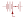
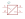
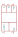

# e-stromversorgungselemente

| Symbol | Abbildung |
|---|---|
| `BATTERIE-MIT-BEWEGBAREM-SPANNUNGSABGRIFF` |  |
| `NETZTEIL_GLEICHSPANNUNG` |  |
| `NETZTEIL_MURR_24V` |  |
| `PRIMAERELEMENT-AKKUMULATOR-[ZELLE]-BATTERIE` |  |

