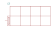

# eib-busch-jaeger

| Symbol | Abbildung |
|---|---|
| `6010-25` |  |
| `6020-XX` |  |
| `6021-XX` |  |
| `6108-U` |  |
| `6109-U` |  |
| `6110-U-101` |  |
| `6114-U` |  |
| `6115-XX-101` |  |
| `6116-XX-101` |  |
| `6117-XX-101` |  |
| `6119 20` |  |
| `6119 40` |  |
| `6122-XX` |  |
| `6123-XX` |  |
| `6123USB-XX` |  |
| `6124-XX` |  |
| `6125-XX` |  |
| `6126-XX` |  |
| `6127-XX` |  |
| `6127MF-XX` |  |
| `6128-XX` |  |
| `6129-XX` |  |
| `6131-XX-102` |  |
| `6132-XX-102` |  |
| `6132-XX-102M` |  |
| `6133-XX-101` |  |
| `6133USB-XX` |  |
| `6134 10` |  |
| `6134-XX-102` |  |
| `6135-XX-102` |  |
| `6136 100C` |  |
| `6136 100CB` |  |
| `6136 100M` |  |
| `6136 30M` |  |
| `6136 40-101` |  |
| `6136-XX` |  |
| `6140-101` |  |
| `6144 10-101` |  |
| `6146` |  |
| `6146-101` |  |
| `6151EB` |  |
| `6152EB-101` |  |
| `6153EB` |  |
| `6155EB-101` |  |
| `6156EB` |  |
| `6157EB` |  |
| `6158EB` |  |
| `6164 40` |  |
| `6164U` |  |
| `6172AG-101` |  |
| `6173AG-101` |  |
| `6174 10` |  |
| `6174 11` |  |
| `6174 12` |  |
| `6174 13` |  |
| `6174 14` |  |
| `6174 15` |  |
| `6174 16` |  |
| `6174 17` |  |
| `6174 18` |  |
| `6174 19` |  |
| `6174 20` |  |
| `6174 21` |  |
| `6179-XX` |  |
| `6180 10` |  |
| `6180 11` |  |
| `6180-102` |  |
| `6181-101` |  |
| `6186 20` |  |
| `6186 30` |  |
| `6186USB` |  |
| `6187-103` |  |
| `6188 13` |  |
| `6188 14` |  |
| `6188 15` |  |
| `6188 16` |  |
| `6188 17` |  |
| `6188 18` |  |
| `6190 10` |  |
| `6190 40-101` |  |
| `6193 32` |  |
| `6194 11` |  |
| `6194 12` |  |
| `6194 13` |  |
| `6194 14` |  |
| `6194 15` |  |
| `6194 16` |  |
| `6194 17` |  |
| `6195 21` |  |
| `6195 22` |  |
| `6195 24` |  |
| `6195 25` |  |
| `6195 26` |  |
| `6196 20` |  |
| `6196 40-101` |  |
| `6196 41-101` |  |
| `6196 42` |  |
| `6196 43` |  |
| `6196 80` |  |
| `6196 82` |  |
| `6197 22` |  |
| `6197 40` |  |
| `6198 JA` |  |
| `6198-101` |  |
| `6198ST` |  |
| `6321-XX` |  |
| `6322-XX-101` |  |
| `6323-XX` |  |
| `6324-XX` |  |
| `6325-XX` |  |
| `6326-XX-101` |  |
| `6327-XX` |  |

