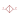
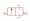
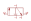
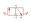
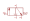
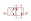
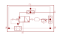

# pneumatic

| Symbol | Abbildung |
|---|---|
| `AIR_PREPARATION` |  |
| `CYL_DOUBLE` |  |
| `CYL_DOUBLE_OUT` |  |
| `CYL_SINGLE` |  |
| `EJECTOR_2` |  |
| `EJECTOR_4` |  |
| `EXHAUST` |  |
| `FILTER` |  |
| `FLOW_CONTROL` |  |
| `FLOW_CONTROL_ONE_WAY_EXH` |  |
| `FLOW_CONTROL_ONE_WAY_SUP` |  |
| `GRP_DOUBLE_ANG` |  |
| `GRP_DOUBLE_PAR` |  |
| `GRP_SINGLE_ANG_EXT` |  |
| `GRP_SINGLE_ANG_INT` |  |
| `GRP_SINGLE_FING` |  |
| `GRP_SINGLE_PAR_EXT` |  |
| `GRP_SINGLE_PAR_INT` |  |
| `LOGIC_AND_VALVE` |  |
| `LOGIC_OR_VALVE` |  |
| `NON_RETURN_VALVE` |  |
| `PRESSURE_REGULATOR` |  |
| `PRESSURE_SUPPLY` |  |
| `SUCTION_CUP` |  |
| `SWITCH_CYLINDER` |  |
| `SWITCH_PRESSURE` |  |
| `SWITCH_VACUUM` |  |
| `TAP` |  |
| `TUBE_FLEX` |  |
| `VALVE` |  |
| `VALVE_2_2_NC` |  |
| `VALVE_2_2_NC_14` |  |
| `VALVE_2_2_NO` |  |
| `VALVE_2_2_NO_14` |  |
| `VALVE_3_2_NC` |  |
| `VALVE_3_2_NC_14` |  |
| `VALVE_3_2_NO` |  |
| `VALVE_3_2_NO_14` |  |
| `VALVE_4_2` |  |
| `VALVE_5_2` |  |
| `VALVE_ACT_COIL` |  |
| `VALVE_ACT_DETENT` |  |
| `VALVE_ACT_GENERAL` |  |
| `VALVE_ACT_LEVER` |  |
| `VALVE_ACT_PEDAL` |  |
| `VALVE_ACT_PLUNGER` |  |
| `VALVE_ACT_PNEUMATIC_10` |  |
| `VALVE_ACT_PNEUMATIC_12` |  |
| `VALVE_ACT_PNEUMATIC_14` |  |
| `VALVE_ACT_PUSHBUTTON` |  |
| `VALVE_ACT_ROLLER` |  |
| `VALVE_ACT_ROLLER_IDLE` |  |
| `VALVE_ACT_SPRING` |  |
| `VALVE_ELE_2_2_SA_NC` |  |
| `VALVE_ELE_2_2_SA_NC_14` |  |
| `VALVE_ELE_2_2_SA_NO` |  |
| `VALVE_ELE_2_2_SA_NO_14` |  |
| `VALVE_ELE_3_2_DA` |  |
| `VALVE_ELE_3_2_DA_14` |  |
| `VALVE_ELE_3_2_SA_NC` |  |
| `VALVE_ELE_3_2_SA_NC_14` |  |
| `VALVE_ELE_3_2_SA_NO` |  |
| `VALVE_ELE_3_2_SA_NO_14` |  |
| `VALVE_ELE_4_2_DA` |  |
| `VALVE_ELE_4_2_SA` |  |
| `VALVE_ELE_5_2_DA` |  |
| `VALVE_ELE_5_2_SA` |  |
| `VALVE_PNE_2_2_SA_NC` |  |
| `VALVE_PNE_2_2_SA_NC_14` |  |
| `VALVE_PNE_2_2_SA_NO` |  |
| `VALVE_PNE_2_2_SA_NO_14` |  |
| `VALVE_PNE_3_2_DA` |  |
| `VALVE_PNE_3_2_DA_14` |  |
| `VALVE_PNE_3_2_SA_NC` |  |
| `VALVE_PNE_3_2_SA_NC_14` |  |
| `VALVE_PNE_3_2_SA_NO` |  |
| `VALVE_PNE_3_2_SA_NO_14` |  |
| `VALVE_PNE_4_2_DA` |  |
| `VALVE_PNE_4_2_SA` |  |
| `VALVE_PNE_5_2_DA` |  |
| `VALVE_PNE_5_2_SA` |  |
| `VALVE_START_BLOCK` |  |
| `VALVE_TIME_DELAY_OFF` |  |
| `VALVE_TIME_DELAY_ON` |  |

